# Collabs

Webapp build using Reactjs and firebase  
A very comprehensive app which was build to create a collaborative environment between the people of an educational organization.

This app provides a wide range of features for every member of the organization which makes it a great platform for everyone.

User roles in this app:
### 1. Manager : 
The person who is the owner of this application and the sole founder of collabs. Any organization who wants to be a part of collabs needs to request access from the Manager.

### 2. Dean :
Organization head, who deligates different roles and adds people onto the platform so that they can login and use the app

### 3. Faculty :
Subject teacher who can add students and track their performance based on work (assignments) assigned to them.

### 4. Student :
A learner who manages his work given by the faculty and track his/her performance.

### 5. Guest :
Any person who wants a live walkthrough of this app can choose guest login from the homepage of this app.

Each of the above mentioned roles have multiple aspects to interact with which makes this platform unique and one of a kind.

### Manager dashboard 
This snapshot shows the organizations which are currently using this app.

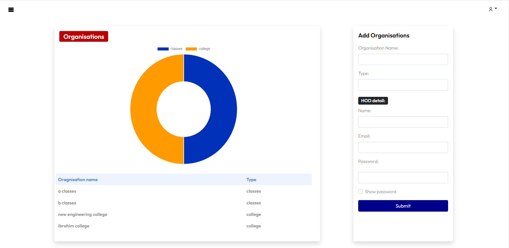

### Add Event announcements 
Add event section (on dean dashboard) displaying a calendar which adds to a user friendly design

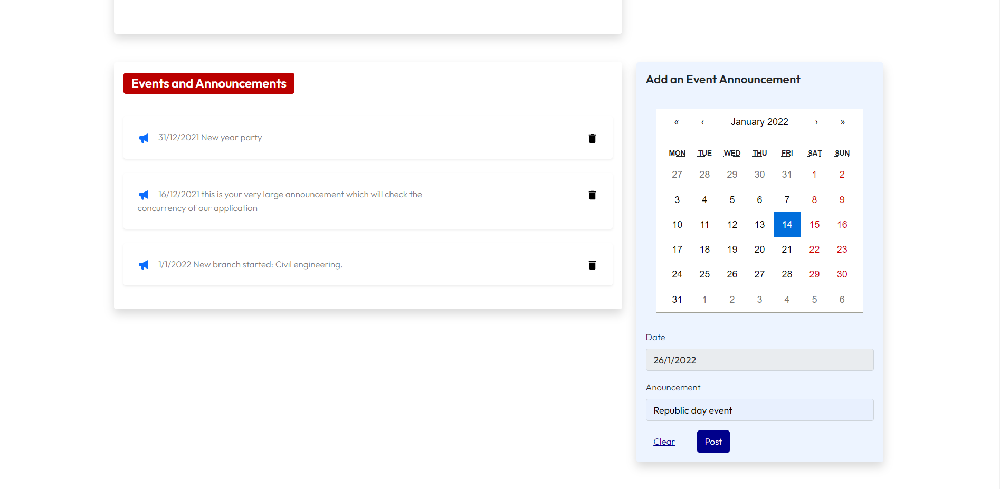

### Create a new branch
Dean can create multiple branches for his organization with the help of dynamic field inputs in forms

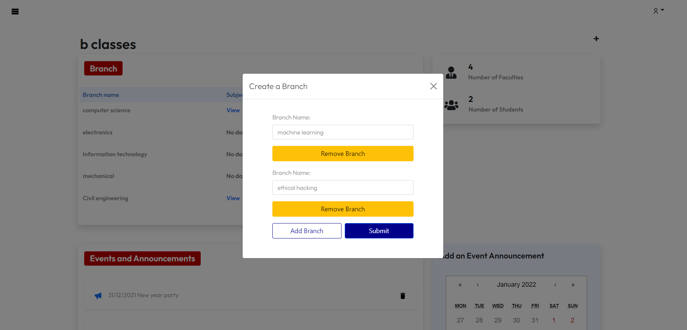

### Left navigation bar 
Offcanvas which helps in navigating between pages

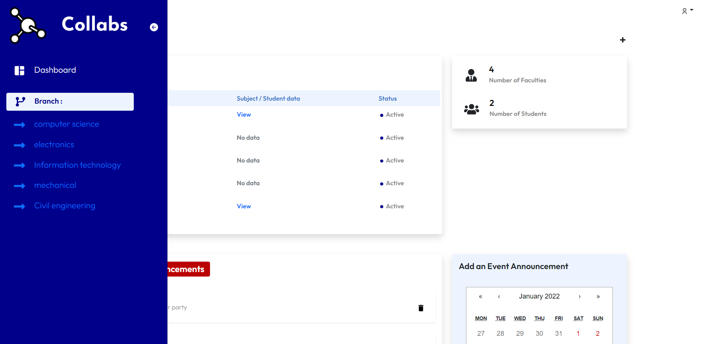

### Subject announcements 
Private announcements which belong to a particular subject and its people

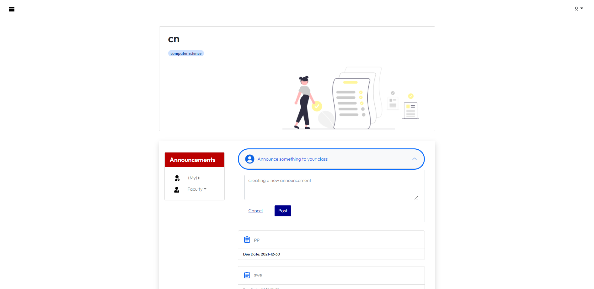

### Assignment dashboard 
submission progress is shown in graphical format

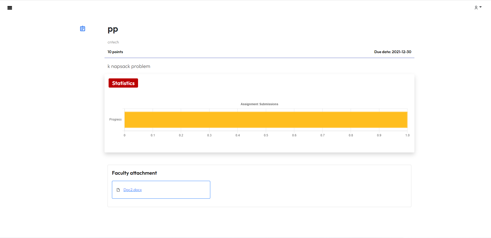

### Student invites
Add new students to the organization (from faculty dashboard) with the help of dynamic field inputs in forms

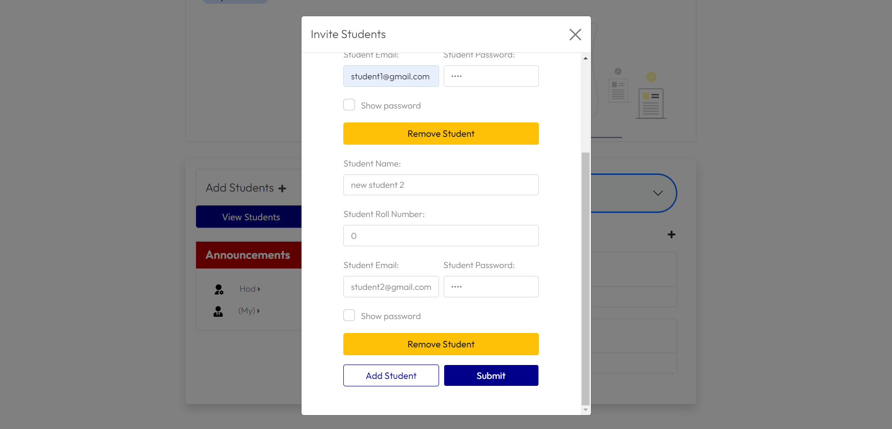

### Faculty can add attachments so that students can refer to them

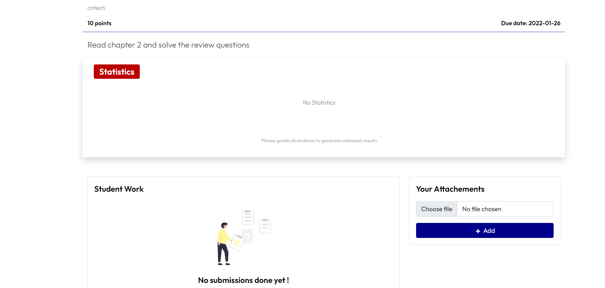

### Assignment dashboard
Students can submit their assignment work (upload files)

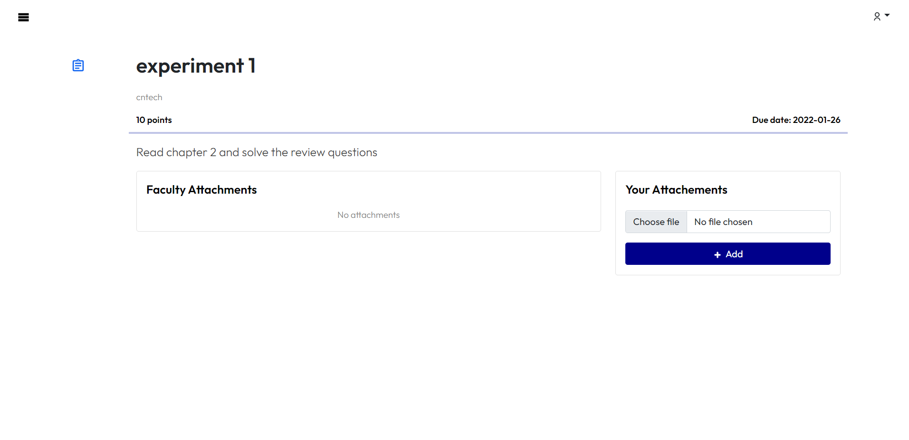

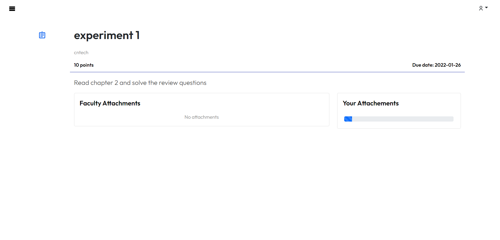

### Faculty after assesing the assignments get clear statistics which shows students performance

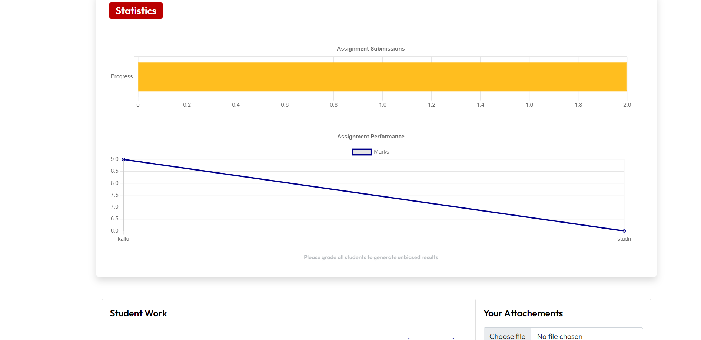
